# Signal2Mail

A proof-of-concept bridge for forwarding Signal messages to email. This lightweight application demonstrates how Signal messages can be automatically forwarded to email addresses, including attachments.

## Overview

Signal2Mail was developed as a short sprint to validate the feasibility of Signal-to-email integration. It connects to the Signal messaging service via a REST API and monitors for incoming messages, formatting and sending them to a specified email address using msmtp.

```mermaid
graph LR
    A[Signal Network] --> B[signal-cli-rest-api Container]
    
    subgraph Signal2Mail["Signal2Mail"]
        B --> C[SignalEmailBridge]
        C --> D[msmtp]
    end
    
    D --> E[Email Inbox]
    
    classDef default fill:#343F5A,stroke:#333,stroke-width:2px,color:white;
    
    style A fill:#AB7F1F
    style B fill:#31363D
    style C fill:#343F5A
    style D fill:#AB7F1F
    style E fill:#69252B
    style Signal2Mail fill:none,stroke:#4CAF50,stroke-width:3px,color:#333
```



## Current Features (Proof of Concept)

- Forward text messages from Signal to email
- Include image attachments in forwarded emails
- Preserve sender information and timestamps
- Run as a background service

## Production Requirements

For enterprise deployment, several enhancements would be required:

1. **UI and Multi-Account Management**
   - Web interface for account management
   - Backend to handle multiple Signal-to-email accounts
   - QR code integration screen for account linking

2. **Enterprise Email Integration**
   - Internal SMTP server integration to keep messages within organization network

3. **Containerized Deployment**
   - REST service container (current implementation)
   - UI application container
   - Orchestration with Kubernetes or other container service

4. **Security and Access Controls**
   - User authentication and authorization
   - Account permission management
   - Audit logging for compliance

## Technical Infrastructure Requirements

For organizational deployment, the following infrastructure is needed:

1. Container platform to host the application
2. Network egress to Signal servers
3. Network ingress for internal website hosting
4. SMTP access to organization mail servers
5. User management system for controlling access
6. Storage for account configurations and temporary attachments

## Installation (of this Proof of Concept)

This project uses [signal-cli-rest-api](https://github.com/bbernhard/signal-cli-rest-api) as its backend interface to the Signal network. The setup primarily involves configuring this interface with your Signal account.

### Prerequisites

- Linux machine
- Docker and Docker Compose
- Python 3.10 or later
- msmtp

### 1. Set up msmtp

First, install msmtp:

```bash
sudo apt-get update
sudo apt-get install msmtp msmtp-mta
```

Create an msmtp configuration file at `~/.msmtprc`:
```
defaults
auth           on
tls            on
tls_trust_file /etc/ssl/certs/ca-certificates.crt
logfile        ~/.msmtp.log

account        default
host           smtp.example.com
port           587
from           your-email@example.com
user           your-username
password       your-password
```

Set correct permissions:

```bash
chmod 600 ~/.msmtprc
```

Test your configuration:

```bash
echo "Test email body" | msmtp --from=signal@local your-email@example.com
```

### 2. Clone this repository

```bash
git clone https://github.com/yhavinga/signal2mail.git
cd signal2mail
```

### 3. Set up Python environment

```bash
python -m venv venv
source venv/bin/activate
pip install requests
```

## Configuration

### 1. Start the Signal CLI REST API

The following command starts the signal-cli-rest-api container which provides the REST interface to the Signal network:

```bash
docker-compose up
```

### 2. Link your Signal account

Open your web browser and navigate to:

```
http://localhost:8080/v1/qrcodelink?device_name=signal2mail
```

This will return a page with a QR code. You need to scan this QR code with your primary Signal device:

1. Open Signal on your phone
2. Go to Settings → Linked Devices
3. Tap the "+" button to add a new device
4. Scan the QR code displayed in your browser

### 3. Update the SignalEmailBridge configuration

In `receive_and_email.py`, update the configuration parameters at the bottom:

```python
bridge = SignalEmailBridge(
    api_url="http://localhost:8080",
    phone_number='+yourphonenumber',
    email_to="your-email@example.com",
    email_from="signal@local"
)
```

## Running the application

Start the application:

```bash
python receive_and_email.py
```

## Troubleshooting

- **No messages forwarded**: Check Signal CLI logs with `docker logs signal-cli-rest-api`
- **Email not sending**: Verify msmtp configuration and logs
- **Signal connection issues**: Ensure the QR code setup was completed successfully

## Security Notes

- This application runs in "native" mode for better performance
- msmtp configuration contains sensitive information, ensure proper file permissions
- Consider using environment variables or a secure secrets manager for passwords

## License

This project is released under the MIT License.
